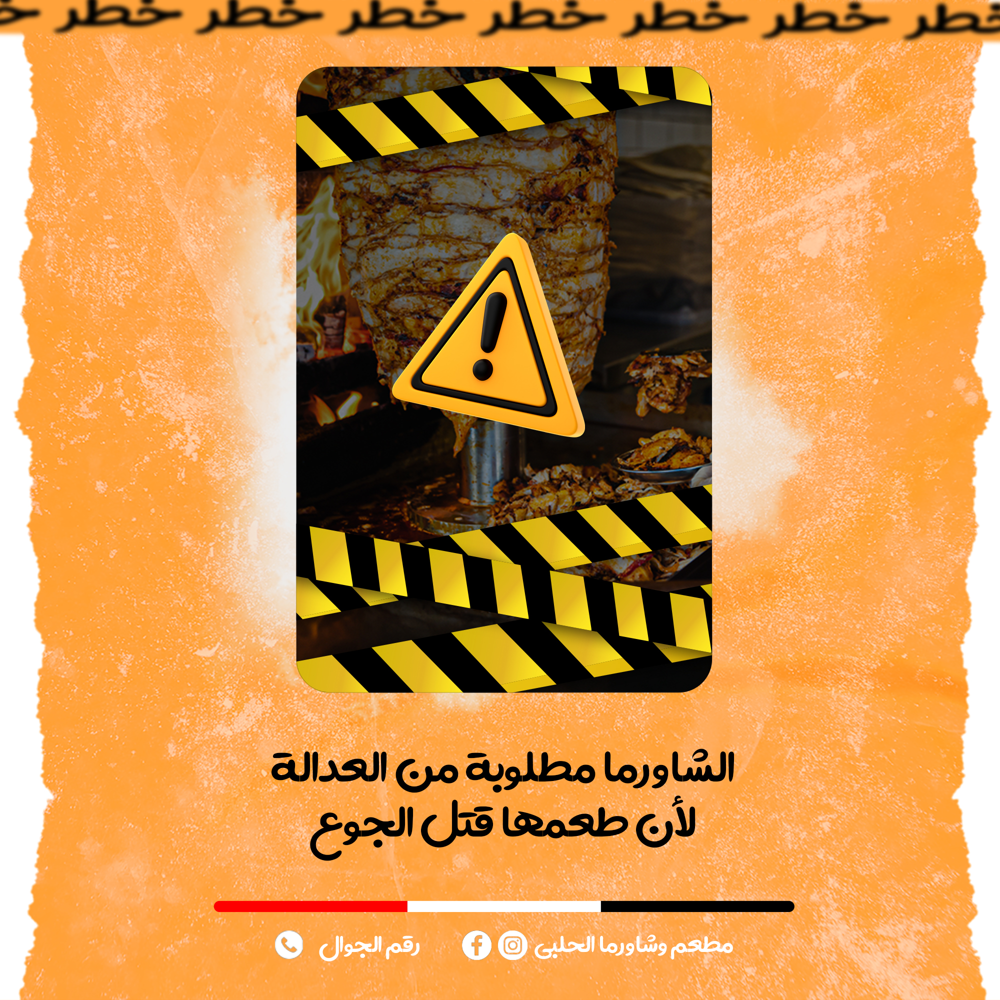
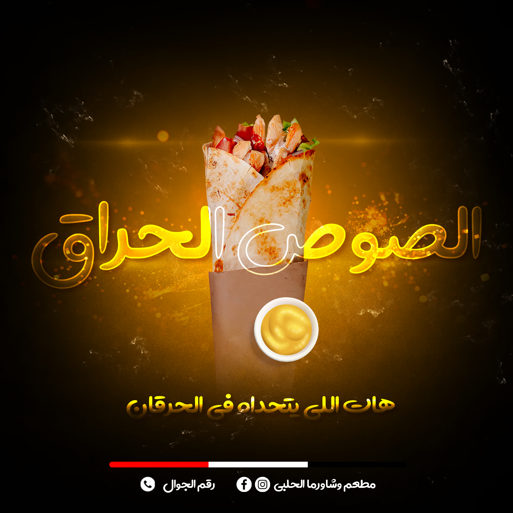
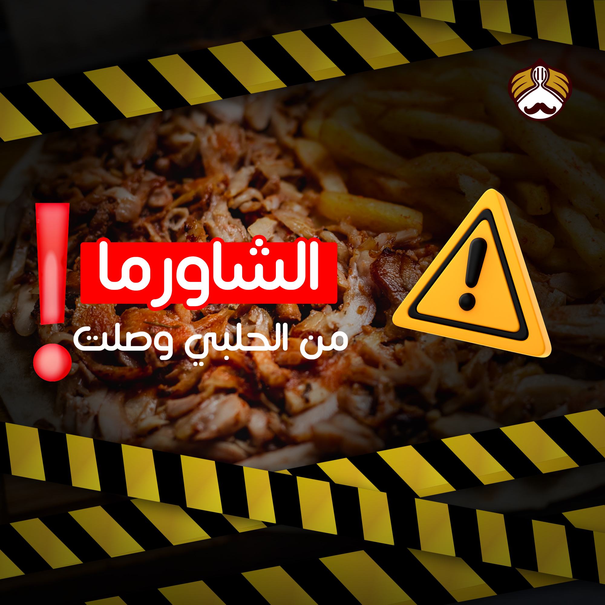
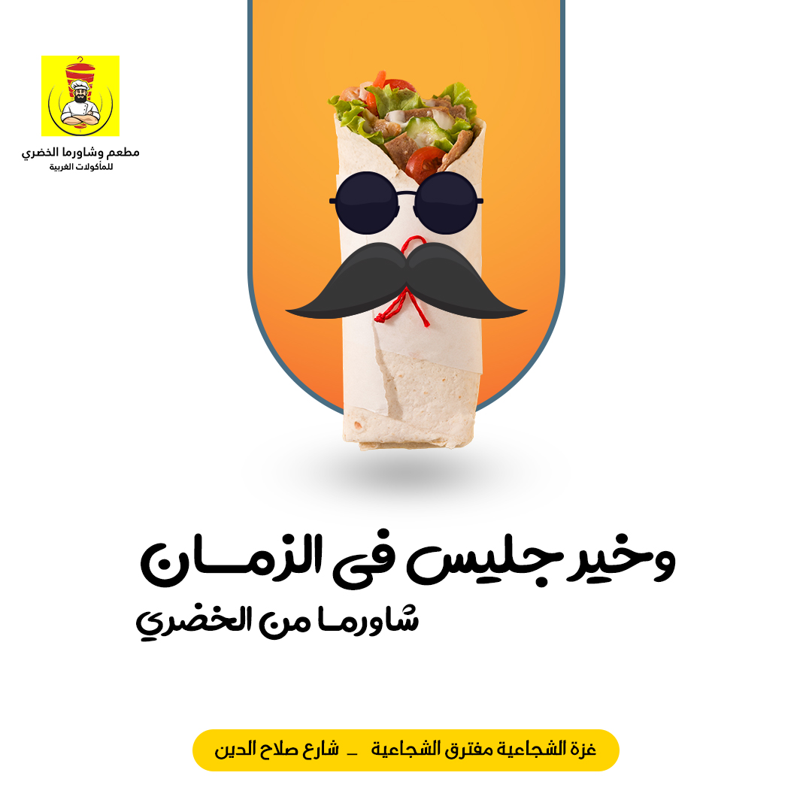

<!DOCTYPE html>
<html lang="en">
<head>
    <meta charset="UTF-8">
    <meta http-equiv="X-UA-Compatible" content="IE=edge">
    <meta name="viewport" content="width=device-width, initial-scale=1.0">
    <link rel="stylesheet" href="https://cdnjs.cloudflare.com/ajax/libs/font-awesome/6.1.2/css/all.min.css">
    <link rel="stylesheet" href="style.css">
    <title>Mahmoud</title>
</head>
<body>
   
    <header>
        <a href="#" class="logo">Mahmoud</a>
        <nav class="navigation a">
            <a href="#services">Services</a>
            <a href="#projects">Projects</a>
            <a href="#contact">Contact</a>
        </nav>
    </header>

    <section class="main">
        

            <h2>Hello, I'm Mahmoud Social Media Designer</h2>
            <h3>I design success to the world</h3>
            <a href="#projects" class="main-btn">View my work</a>
            

                <a href="tel:%E2%80%8B+970592411812"><i class="fa-solid fa-phone"></i></a>
                <a href="https://www.instagram.com/mahmoud.rafiq1"><i class="fa-brands fa-instagram"></i></a>
                <a href="https://www.facebook.com/mahmoud.rafiq123"><i class="fa-brands fa-facebook"></i></a>
            

        

    </section>
    <section class="cards" id="services">
        <h2 class="title">Services</h2>
        

            

                

                    <i class="fa-solid fa-object-ungroup"></i>
                

                

                    <h3>Designing</h3>
                    
The entire process of creating graphics including illustrations, logos, layouts and photos.

                

            

            

                

                    <i class="fa-solid fa-bars-progress"></i>
                

                

                    <h3>Page Managment</h3>
                    
The collection of processes used to ensure your page is professional and up-to-date.

                

            

            

                

                    <i class="fa-solid fa-file-word"></i>
                

                

                    <h3>Content Writing</h3>
                    
The process of planning, writing and editing web content, typically for digital marketing purposes.

                

            

        

    </section>

    <section class="projects" id="projects">
        <h2 class="title">Projects</h2>
        

            

                

                    
                    

                        

                            
Shawarma Sandwiches Design For Al-Halabi Resturant.

                            <strong class="project-title">
                                Food Social Media Design
                            </strong>
                        

                    

                

            

            

                

                    
                    

                        

                            
New Hot Sauce Design For Al-Halabi Resturant.

                            <strong class="project-title">
                                Food Social Media Design
                            </strong>
                        

                    

                

            

            

                

                    
                    

                        

                            
Tasty Shawarma  Design For Al-Halabi Resturant.

                            <strong class="project-title">
                                Food Social Media Design
                            </strong>
                        

                    

                

            

            

                

                    
                    

                        

                            
Good Looking Shawarma Wrap Design For Al-Khodary Resturant.

                            <strong class="project-title">
                                Food Social Media Design
                            </strong>
                        

                    

                

            

            

                

                    
                    

                        

                            
Congratulations On New Year 2022 Event.

                            <strong class="project-title">
                                New Year Social Media Design
                            </strong>
                        

                    

                

            

            

                

                    
                    

                        

                            
Learn English Language Social Media Design For Best English Center.

                            <strong class="project-title">
                                Learn English Language Design
                            </strong>
                        

                    

                

            

            
        

    </section>

    <section class="cards-contact" id="contact">
        <h2 class="title">Let's Work Together.</h2>
        

            

                

                    <i class="fa-solid fa-envelope"></i>
                

                

                    <h3>Mail</h3>
                    
m424150274@gmail.com

                

            

            

                

                    <i class="fa-solid fa-phone"></i>
                

                

                    <h3>Phone</h3>
                    
+970592411812

                

    </section>

    <footer class="footer">
        
Copyrights @ Mahmoud Rafiq

        

            <a href="tel:%E2%80%8B+970592411812"><i class="fa-solid fa-phone"></i></a>
            <a href="https://www.instagram.com/mahmoud.rafiq1"><i class="fa-brands fa-instagram"></i></a>
            <a href="https://www.facebook.com/mahmoud.rafiq123"><i class="fa-brands fa-facebook"></i></a>
        

    </footer>

</body>
</html>
